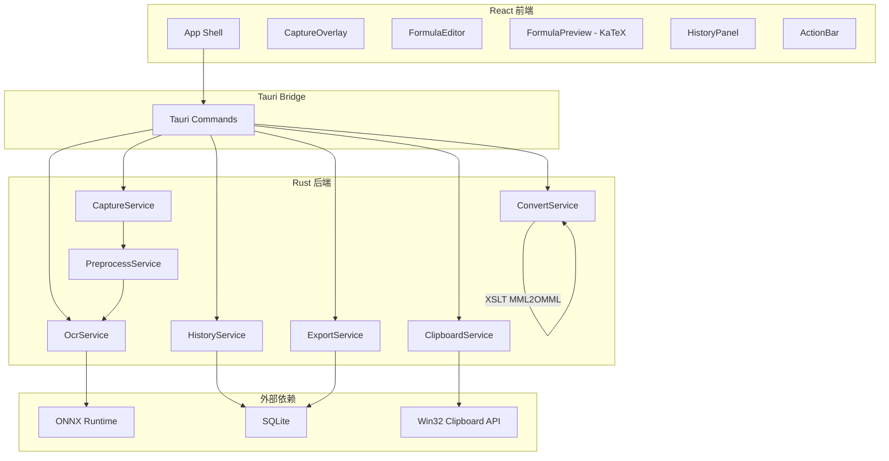
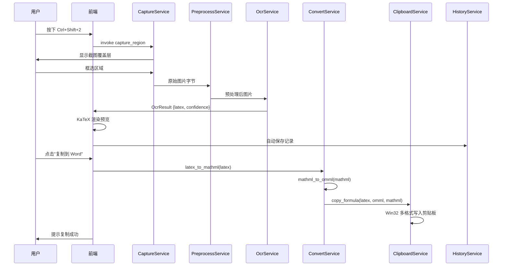

# 设计文档：FormulaSnap

## 概述

FormulaSnap 是一款基于 Tauri v2 的离线桌面端工具，核心流程为：全局快捷键截图 → 离线 OCR 识别为 LaTeX → 编辑与预览 → 多格式剪贴板写入（OMML/MathML/plain）→ Word 粘贴为可编辑公式。

系统采用 Rust 后端 + React/TypeScript 前端架构。Rust 端负责截图、OCR 推理、格式转换、剪贴板操作、SQLite 存储和文件导出；React 端负责 UI 交互、LaTeX 编辑和 KaTeX 渲染预览。

### 关键技术决策

1. **OCR 引擎**：使用 pix2tex (LaTeX-OCR) 的 ONNX 模型，通过 `ort` (ONNX Runtime Rust binding) 在 Rust 端直接推理，避免 Python 依赖
2. **LaTeX → MathML**：使用 Rust crate `latex2mathml`，纯 Rust 实现，无外部依赖
3. **MathML → OMML**：通过内嵌 XSLT 样式表（基于 Microsoft 官方 MML2OMML.XSL）在 Rust 端完成转换
4. **剪贴板**：使用 Windows Win32 API（`clipboard-win` crate）注册自定义格式并写入多格式数据
5. **存储**：使用 `rusqlite` 进行 SQLite 操作
6. **前端渲染**：KaTeX 实时渲染 LaTeX 预览

## 架构

### 整体架构图



### 数据流



## 组件与接口

### CaptureService（截图服务）

负责全局热键注册和屏幕区域截图。

```rust
// src-tauri/src/capture.rs

use serde::{Deserialize, Serialize};

#[derive(Debug, Serialize, Deserialize)]
pub struct CaptureConfig {
    pub shortcut: String, // 默认 "Ctrl+Shift+2"
}

#[derive(Debug, thiserror::Error)]
pub enum CaptureError {
    #[error("热键注册失败: {0}")]
    HotkeyRegistration(String),
    #[error("截图失败: {0}")]
    CaptureFailed(String),
    #[error("用户取消截图")]
    Cancelled,
}

/// 注册全局快捷键
pub fn register_hotkey(config: &CaptureConfig) -> Result<(), CaptureError>;

/// 框选截图，返回 PNG 字节
pub fn capture_region() -> Result<Vec<u8>, CaptureError>;

/// 注销全局快捷键
pub fn unregister_hotkey() -> Result<(), CaptureError>;
```

### PreprocessService（图像预处理）

对截图进行裁边、增强、缩放等预处理。

```rust
// src-tauri/src/preprocess.rs

#[derive(Debug, Clone, Serialize, Deserialize)]
pub struct PreprocessOptions {
    pub auto_crop: bool,        // 自动裁边
    pub enhance_contrast: bool, // 对比度增强
    pub target_height: u32,     // 模型推荐高度
}

impl Default for PreprocessOptions {
    fn default() -> Self {
        Self {
            auto_crop: true,
            enhance_contrast: false,
            target_height: 64,
        }
    }
}

/// 预处理图片，返回处理后的图片字节
pub fn preprocess(image: &[u8], options: &PreprocessOptions) -> Result<Vec<u8>, PreprocessError>;
```

### OcrService（OCR 识别）

使用 ONNX Runtime 加载 pix2tex 模型进行离线推理。

```rust
// src-tauri/src/ocr.rs

#[derive(Debug, Clone, Serialize, Deserialize)]
pub struct OcrResult {
    pub latex: String,
    pub confidence: f64, // 0.0 ~ 1.0
}

#[derive(Debug, thiserror::Error)]
pub enum OcrError {
    #[error("模型加载失败: {0}")]
    ModelLoad(String),
    #[error("推理失败: {0}")]
    InferenceFailed(String),
    #[error("识别超时")]
    Timeout,
    #[error("识别结果为空")]
    EmptyResult,
}

/// 初始化 OCR 引擎（加载模型）
pub fn init_engine(model_path: &str) -> Result<OcrEngine, OcrError>;

/// 识别图片中的公式
pub fn recognize(engine: &OcrEngine, image: &[u8]) -> Result<OcrResult, OcrError>;
```

### ConvertService（格式转换）

LaTeX → MathML → OMML 转换链。

```rust
// src-tauri/src/convert.rs

#[derive(Debug, thiserror::Error)]
pub enum ConvertError {
    #[error("LaTeX 转 MathML 失败: {0}")]
    LatexToMathml(String),
    #[error("MathML 转 OMML 失败: {0}")]
    MathmlToOmml(String),
    #[error("不支持的 LaTeX 符号: {0}")]
    UnsupportedSymbol(String),
}

/// LaTeX → MathML
pub fn latex_to_mathml(latex: &str) -> Result<String, ConvertError>;

/// MathML → OMML（通过 XSLT）
pub fn mathml_to_omml(mathml: &str) -> Result<String, ConvertError>;

/// LaTeX → OMML（组合调用）
pub fn latex_to_omml(latex: &str) -> Result<String, ConvertError>;

/// 格式化 OMML 为可读 XML
pub fn pretty_print_omml(omml: &str) -> Result<String, ConvertError>;
```

### ClipboardService（剪贴板服务）

使用 Win32 API 写入多格式剪贴板数据。

```rust
// src-tauri/src/clipboard.rs

#[derive(Debug, thiserror::Error)]
pub enum ClipboardError {
    #[error("剪贴板打开失败: {0}")]
    OpenFailed(String),
    #[error("格式写入失败: {0}")]
    WriteFailed(String),
}

/// 多格式写入剪贴板（OMML + MathML + plain text LaTeX）
pub fn copy_formula(latex: &str, omml: &str, mathml: &str) -> Result<(), ClipboardError>;

/// 仅复制 LaTeX 文本
pub fn copy_latex(latex: &str) -> Result<(), ClipboardError>;
```

**剪贴板写入策略**：
1. 使用 `RegisterClipboardFormat` 注册 "MathML" 和 "OMML" 自定义格式
2. 调用 `OpenClipboard` → `EmptyClipboard`
3. 依次写入：`CF_UNICODETEXT`（LaTeX）、自定义 MathML 格式、自定义 OMML 格式、`CF_HTML`（包含 MathML 的 HTML 片段）
4. 调用 `CloseClipboard`

### HistoryService（历史记录）

基于 SQLite 的 CRUD 和搜索。

```rust
// src-tauri/src/history.rs

#[derive(Debug, Clone, Serialize, Deserialize)]
pub struct HistoryRecord {
    pub id: Option<i64>,
    pub created_at: String,       // ISO 8601
    pub original_latex: String,
    pub edited_latex: Option<String>,
    pub confidence: f64,
    pub engine_version: String,
    pub thumbnail: Option<Vec<u8>>, // PNG 缩略图
    pub is_favorite: bool,
}

#[derive(Debug, thiserror::Error)]
pub enum HistoryError {
    #[error("数据库操作失败: {0}")]
    DatabaseError(String),
    #[error("记录未找到: {0}")]
    NotFound(i64),
}

/// 初始化数据库（建表）
pub fn init_db(db_path: &str) -> Result<(), HistoryError>;

/// 保存记录，返回 ID
pub fn save(record: &HistoryRecord) -> Result<i64, HistoryError>;

/// 按关键词搜索
pub fn search(query: &str) -> Result<Vec<HistoryRecord>, HistoryError>;

/// 切换收藏状态
pub fn toggle_favorite(id: i64) -> Result<(), HistoryError>;

/// 获取单条记录
pub fn get_by_id(id: i64) -> Result<HistoryRecord, HistoryError>;

/// 删除记录
pub fn delete(id: i64) -> Result<(), HistoryError>;

/// 获取多条记录（用于导出）
pub fn get_by_ids(ids: &[i64]) -> Result<Vec<HistoryRecord>, HistoryError>;
```

### ExportService（导出服务）

```rust
// src-tauri/src/export.rs

#[derive(Debug, Clone, Serialize, Deserialize)]
pub struct TexExportOptions {
    pub add_time_comments: bool, // 是否添加时间注释分隔
}

#[derive(Debug, thiserror::Error)]
pub enum ExportError {
    #[error("导出失败: {0}")]
    ExportFailed(String),
    #[error("转换失败: {0}")]
    ConvertFailed(String),
}

/// 导出为 .tex 文件
pub fn export_tex(records: &[HistoryRecord], options: &TexExportOptions) -> Result<Vec<u8>, ExportError>;

/// 导出为 .docx 文件
pub fn export_docx(records: &[HistoryRecord]) -> Result<Vec<u8>, ExportError>;
```

### 前端组件

```typescript
// React 组件接口

// FormulaEditor - LaTeX 编辑器
interface FormulaEditorProps {
  latex: string;
  onChange: (latex: string) => void;
  wrapMode: 'inline' | 'display'; // \(...\) 或 \[...\]
  onWrapModeChange: (mode: 'inline' | 'display') => void;
}

// FormulaPreview - KaTeX 渲染预览
interface FormulaPreviewProps {
  latex: string;
  displayMode: boolean;
}

// HistoryPanel - 历史面板
interface HistoryPanelProps {
  onSelect: (record: HistoryRecord) => void;
  onCopyToWord: (record: HistoryRecord) => void;
  onCopyLatex: (record: HistoryRecord) => void;
}

// ActionBar - 操作按钮栏
interface ActionBarProps {
  onCopyToWord: () => void;
  onCopyLatex: () => void;
  onRetry: () => void;
  onSave: () => void;
  isConverting: boolean;
}
```

## 数据模型

### SQLite 表结构

```sql
CREATE TABLE IF NOT EXISTS history (
    id INTEGER PRIMARY KEY AUTOINCREMENT,
    created_at TEXT NOT NULL DEFAULT (datetime('now')),
    original_latex TEXT NOT NULL,
    edited_latex TEXT,
    confidence REAL NOT NULL DEFAULT 0.0,
    engine_version TEXT NOT NULL,
    thumbnail BLOB,
    is_favorite INTEGER NOT NULL DEFAULT 0
);

CREATE INDEX idx_history_created_at ON history(created_at DESC);
CREATE INDEX idx_history_is_favorite ON history(is_favorite);
CREATE INDEX idx_history_latex ON history(original_latex);
```

### 前端状态模型（Zustand Store）

```typescript
interface FormulaState {
  // 当前编辑状态
  currentLatex: string;
  originalLatex: string;
  confidence: number;
  screenshotData: Uint8Array | null;
  wrapMode: 'inline' | 'display';
  
  // UI 状态
  isCapturing: boolean;
  isRecognizing: boolean;
  isConverting: boolean;
  error: string | null;
  
  // 历史
  historyRecords: HistoryRecord[];
  searchQuery: string;
  
  // Actions
  setLatex: (latex: string) => void;
  setWrapMode: (mode: 'inline' | 'display') => void;
  startCapture: () => Promise<void>;
  copyToWord: () => Promise<void>;
  copyLatex: () => Promise<void>;
  searchHistory: (query: string) => Promise<void>;
  toggleFavorite: (id: number) => Promise<void>;
}
```

### Tauri Command 接口

```rust
// src-tauri/src/main.rs - Tauri Commands

#[tauri::command]
async fn capture_screenshot() -> Result<Vec<u8>, String>;

#[tauri::command]
async fn recognize_formula(image: Vec<u8>) -> Result<OcrResult, String>;

#[tauri::command]
async fn convert_to_omml(latex: String) -> Result<String, String>;

#[tauri::command]
async fn convert_to_mathml(latex: String) -> Result<String, String>;

#[tauri::command]
async fn copy_formula_to_clipboard(latex: String, omml: String, mathml: String) -> Result<(), String>;

#[tauri::command]
async fn copy_latex_to_clipboard(latex: String) -> Result<(), String>;

#[tauri::command]
async fn save_history(record: HistoryRecord) -> Result<i64, String>;

#[tauri::command]
async fn search_history(query: String) -> Result<Vec<HistoryRecord>, String>;

#[tauri::command]
async fn toggle_favorite(id: i64) -> Result<(), String>;

#[tauri::command]
async fn export_tex(ids: Vec<i64>, options: TexExportOptions) -> Result<Vec<u8>, String>;

#[tauri::command]
async fn export_docx(ids: Vec<i64>) -> Result<Vec<u8>, String>;
```


## 正确性属性

*属性是系统在所有有效执行中都应保持为真的特征或行为——本质上是关于系统应该做什么的形式化陈述。属性是人类可读规格说明与机器可验证正确性保证之间的桥梁。*

### Property 1：无效图片输入拒绝

*For any* 非有效图片格式的字节序列（随机字节、文本文件内容等），将其作为图片输入传递给 FormulaSnap 时，系统应返回错误而非崩溃，且应用状态保持不变。

**Validates: Requirements 2.3**

### Property 2：图像预处理输出尺寸约束

*For any* 有效的输入图片（任意宽高），经过 PreprocessService 预处理后，输出图片的高度应等于模型推荐尺寸（默认 64 像素），且宽度应为正整数。

**Validates: Requirements 3.1**

### Property 3：OCR 置信度范围不变量

*For any* OcrService 返回的 OcrResult，confidence 字段的值应在 [0.0, 1.0] 闭区间内。

**Validates: Requirements 3.2**

### Property 4：撤销/重做往返一致性

*For any* LaTeX 编辑序列（一系列插入、删除操作），执行撤销操作后应恢复到上一步的状态，再执行重做应恢复到撤销前的状态。

**Validates: Requirements 4.3**

### Property 5：LaTeX 包裹格式正确性

*For any* LaTeX 字符串和包裹模式（inline 或 display），包裹函数的输出在 inline 模式下应以 `\(` 开头并以 `\)` 结尾，在 display 模式下应以 `\[` 开头并以 `\]` 结尾，且内部 LaTeX 内容保持不变。

**Validates: Requirements 4.4, 5.5**

### Property 6：无效 LaTeX 渲染错误处理

*For any* 语法错误的 LaTeX 字符串（如未闭合的大括号、未知命令等），KaTeX 渲染应返回错误信息而非空白内容或抛出未捕获异常。

**Validates: Requirements 4.5**

### Property 7：剪贴板多格式写入完整性

*For any* 有效的 LaTeX、OMML 和 MathML 字符串组合，调用 copy_formula 后，从剪贴板读取应能获取到所有三种格式的数据，且内容与写入时一致。

**Validates: Requirements 5.2**

### Property 8：LaTeX → MathML/OMML 转换输出 XML 合法性

*For any* 有效的 LaTeX 数学公式字符串，latex_to_mathml 的输出应是合法的 MathML XML，latex_to_omml 的输出应是合法的 OMML XML（可通过 XML 解析器验证）。

**Validates: Requirements 6.1, 6.2**

### Property 9：OMML Pretty Print 结构保持

*For any* 合法的 OMML XML 字符串，经过 pretty_print_omml 格式化后再解析，应产生与原始 OMML 相同的 XML DOM 结构。

**Validates: Requirements 6.3**

### Property 10：LaTeX → OMML 往返一致性

*For any* 有效的 LaTeX 数学公式，将其转换为 MathML 再转换为 OMML，然后将 OMML 解析回内部表示，应产生与原始 LaTeX 语义等价的数学结构。

**Validates: Requirements 6.4**

### Property 11：不支持符号的错误信息包含性

*For any* 包含不支持 LaTeX 符号的输入字符串，ConvertService 返回的错误信息应包含该不支持符号的名称或表示。

**Validates: Requirements 6.5**

### Property 12：历史记录保存/查询往返一致性

*For any* 有效的 HistoryRecord（包含时间戳、LaTeX、置信度、引擎版本），保存到数据库后通过 ID 查询，返回的记录应包含所有原始字段且值相等。

**Validates: Requirements 7.1**

### Property 13：历史搜索结果完整性与正确性

*For any* 关键词和历史记录数据集，search 返回的所有记录的 LaTeX 内容都应包含该关键词，且数据集中所有包含该关键词的记录都应出现在结果中。

**Validates: Requirements 7.2**

### Property 14：收藏状态切换幂等性

*For any* 历史记录，连续执行两次 toggle_favorite 操作后，该记录的收藏状态应与初始状态相同。

**Validates: Requirements 7.3**

### Property 15：仅保存 LaTeX 配置生效

*For any* 历史记录，当"仅保存 LaTeX 不保存图片"选项启用时，保存后查询的记录 thumbnail 字段应为 null。

**Validates: Requirements 7.6**

### Property 16：.tex 导出完整性与排序

*For any* 历史记录集合和导出选项，export_tex 生成的 .tex 文件应包含所有记录的 LaTeX 内容且按时间升序排列；当 add_time_comments 为 true 时输出应包含时间注释，为 false 时不包含。

**Validates: Requirements 8.1, 8.4**

### Property 17：.docx 导出段落数量一致性

*For any* 历史记录集合，export_docx 生成的 .docx 文件中的公式段落数量应等于输入记录的数量。

**Validates: Requirements 8.2**

## 错误处理

### 错误分层策略

| 层级 | 错误类型 | 处理方式 |
|------|---------|---------|
| CaptureService | 热键冲突、截图失败、用户取消 | 提示用户更换快捷键或重试 |
| PreprocessService | 图片格式无效、处理失败 | 回退到原始图片直接识别 |
| OcrService | 模型加载失败、推理超时、结果为空 | 提示重试或手动输入 LaTeX |
| ConvertService | LaTeX 语法不支持、XSLT 转换失败 | 回退到纯 LaTeX 复制并提示 |
| ClipboardService | 剪贴板打开失败、格式写入失败 | 重试一次，仍失败则提示用户 |
| HistoryService | 数据库损坏、写入失败 | 日志记录，提示用户但不阻塞主流程 |
| ExportService | 文件写入失败、部分转换失败 | 对失败项插入纯文本标注，继续导出其余项 |

### 错误传播规则

1. Rust 端所有错误通过 `Result<T, E>` 传播，禁止使用 `unwrap()`
2. Tauri Command 层将 Rust 错误转换为前端可理解的错误消息
3. 前端通过 Zustand store 的 `error` 字段统一管理错误状态
4. 非致命错误不阻塞 UI，用 toast 通知用户
5. 致命错误（如数据库损坏）显示模态对话框

### 回退策略

- **OCR 失败** → 允许手动输入 LaTeX
- **OMML 转换失败** → 复制纯 LaTeX 并提示在 Word 公式编辑器中粘贴
- **剪贴板写入失败** → 重试一次，仍失败则显示 LaTeX 供手动复制
- **导出部分失败** → 成功项正常导出，失败项标注"转换失败"

## 测试策略

### 测试框架

- **Rust 单元测试**：内置 `#[test]` + `#[tokio::test]`
- **Rust 属性测试**：`proptest` crate（每个属性测试至少 100 次迭代）
- **前端单元测试**：Vitest
- **前端属性测试**：fast-check（每个属性测试至少 100 次迭代）

### 双重测试方法

**单元测试**（具体示例和边界情况）：
- ConvertService：测试具体的 LaTeX 公式转换（上下标、分式、根号、积分、矩阵、希腊字母）
- HistoryService：测试 CRUD 操作的具体场景
- ExportService：测试导出文件的具体格式
- 错误处理：测试各种错误条件的回退行为

**属性测试**（通用属性跨所有输入）：
- 每个属性测试必须引用设计文档中的属性编号
- 标签格式：`Feature: formula-snap, Property {number}: {property_text}`
- 每个正确性属性由一个独立的属性测试实现
- 最少 100 次迭代

### 测试覆盖重点

| 模块 | 单元测试 | 属性测试 |
|------|---------|---------|
| PreprocessService | 具体图片预处理结果 | Property 2: 输出尺寸约束 |
| OcrService | 具体公式识别结果 | Property 3: 置信度范围 |
| ConvertService | 具体公式转换结果 | Property 8, 9, 10, 11: 转换正确性 |
| ClipboardService | 具体格式写入/读取 | Property 7: 多格式完整性 |
| HistoryService | CRUD 具体场景 | Property 12, 13, 14, 15: 数据一致性 |
| ExportService | 具体导出文件格式 | Property 16, 17: 导出完整性 |
| 前端包裹逻辑 | 具体包裹示例 | Property 5: 包裹格式正确性 |
| 前端错误处理 | 具体错误场景 | Property 6: 无效 LaTeX 处理 |
